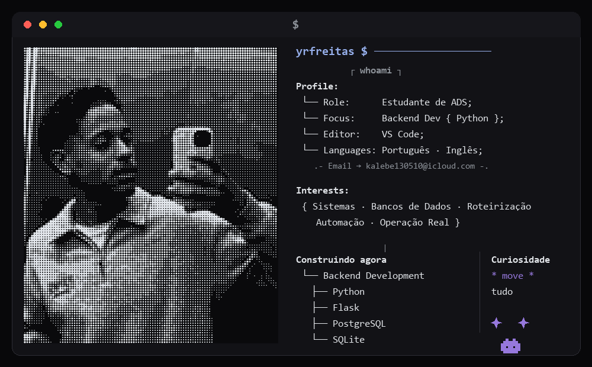
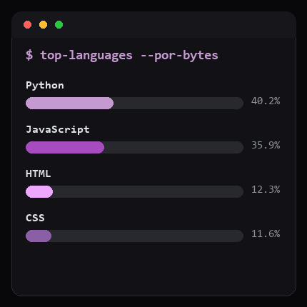

  

  

  

<h3 align="center">
 🔗 <b>Conecte-se comigo:</b>
   
   
  
  &nbsp;&nbsp;
  
</h3>

 

## Sobre

Trabalho como desenvolvedor numa assistência técnica autorizada Panasonic.
Todo dia sai uma equipe para atender clientes espalhados por São Paulo — e cada
decisão de rota, peça e prazo tem custo real. É esse o problema que eu resolvo
em código.

Estudo **Análise e Desenvolvimento de Sistemas** e sou formado em **Marketing**.
Essa mistura virou meu jeito de trabalhar: conheço a operação por dentro, sei o
que cada decisão custa, e construo com isso em mente.

 

## Projeto em produção

<table>
<tr>
<td width="60%" valign="top">

### 🗺️ [Portotec Roteiros](https://github.com/yrfreitas/portote_roteiros)

Roteirização e gestão de atendimentos técnicos.

Um técnico atende de 6 a 10 clientes por dia. A ordem das visitas muda a
quilometragem, o tempo em trânsito e quantos atendimentos cabem no dia.
O sistema monta a rota, acompanha a execução em campo e fecha o ciclo
administrativo depois.

</td>
<td width="40%" valign="top">

**O que tem dentro**

`Nearest Neighbor + 2-opt` 
`PWA instalável` 
`Web Push` 
`Google Sheets API` 
`Leitura de XML da NF-e` 
`Geocodificação em cascata`

</td>
</tr>
</table>

 

## Como penso sobre software

> O que me interessa não é a tecnologia mais nova — é a decisão certa para o
> problema que está na minha frente.

**O app funciona offline, mas nunca serve rota vinda de cache.**
Mostrar uma rota desatualizada para quem está na rua é pior do que não
funcionar.

**O link do técnico não tem senha.**
Exigir login de quem está de moto, entre um atendimento e outro, cria atrito
diário para proteger contra um cenário que não é o real.

**Frontend sem framework.**
Seis telas e nenhum estado compartilhado complexo não pagam o custo de build,
dependências e manutenção.

**Autenticação num ponto único, não espalhada por rota.**
Assim uma rota nova nasce protegida por padrão, e a exceção é que precisa ser
justificada.

 

## Stack

| Backend | Dados | Frontend | Integrações |
|:---:|:---:|:---:|:---:|
| Python · Flask | PostgreSQL · SQLite | JavaScript · Leaflet | Google Sheets · Web Push |
| Gunicorn | Migrações idempotentes | Service Workers | IMAP · NF-e (XML) |

Aberto a oportunidades em desenvolvimento back-end e sistemas para operação.

